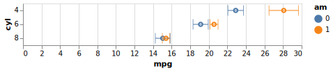

It's December 2020 and it's time to check out different python plotting packages. I primarily will use pandas dataframe plotting with either seaborn's `sns.set()` or [setting plotly as the plotting backend](https://plotly.com/python/pandas-backend/) during data exploration, but there's nothing in python that matches R's `ggplot2`. I've known about [plotnine](https://plotnine.readthedocs.io/en/stable/) as the python equivalent but last time I tried it it was still lacking in the feature department. I'm happy to say that it's totally viable now.

One chart that I often used in R was a 'tie fighter' (error bar) chart. It's handy to compare accuracy for various predictive models. [Here's a motivating example from 'thecodeforest' where he compares various time serious forecasting models in R](https://thecodeforest.github.io/post/tidy_time_series_forecasting.html). I'm also motivated to stick with ggplot because then I'd be able to quickly make plots in R, python, and in Julia (given how seamless `RCall` is in Julia and native support of dataframes).

# Plotnine

Here's what the syntax for a quick tie fighter chart in `plotnine` using the included [`mtcars` dataset](https://stat.ethz.ch/R-manual/R-devel/library/datasets/html/mtcars.html) as a toy example:

```python
from plotnine import *
from plotnine.data import mtcars
import pandas as pd
import numpy as np
from scipy.stats import sem
 
# Calc mean, std error of mpg by number of cylinders and whether they're automatic (0) or manual (1)
df = mtcars.groupby(['cyl', 'am'])['mpg'].agg([np.mean, sem]).reset_index()
 
p = (ggplot(df, aes('factor(cyl)', 'mean', color='factor(am)'))
+ geom_point()
+ geom_errorbar(aes(ymin = 'mean - sem', ymax = 'mean + sem'))
+ coord_flip()
+ labs(title="A Tie Fighter Chart",
        x = 'Cylinders',
        y = 'Mean MPG +/-1 SE')
)

p
```


And what I love about `ggplot2` (and `plotnine`) is the consistent syntax and how easy it is to add or remove customization and complexity compared to the other plotting libraries in python:

```python
# Now it's trivial to add or remove stuff to our plots, even in python!
p + theme(xkcd)
```


One thing we're still missing is the ability to do subtitles and captions, but maybe someday. 

# Altair

[Altair](https://altair-viz.github.io) is another opinionated plotting package based on Vega-lite that has a very consistent syntax that's worth a look. 

Here's the same example as above, but in Altair:

```python
import altair as alt
from plotnine.data import mtcars # for an apples-to-apples comparison

points = alt.Chart(mtcars).mark_point().encode(
    x='average(mpg):Q',
    y='cyl:O',
    color='am:N',
)

error_bars = alt.Chart(mtcars).mark_errorbar(extent='stderr', ticks=True).encode(
  x=alt.X('average(mpg):Q'),
  y=alt.Y('cyl:O'),
  color='am:N',
)

points+error_bars
```



Notice that `Altair` has baked in aggregation and transformations so I didn't have to do my `groupby` and `agg` in `pandas`. And similar to what I like in `ggplot2`/`plotnine` there's the ability to quickly add and remove complexity. But as you can see the result was *so small* on my macbook pro, and I wish there was an easy way to scale the whole thing up to a reasonable aspect ratio (looks like I'd have to scale up each component separately or save as SVG).
